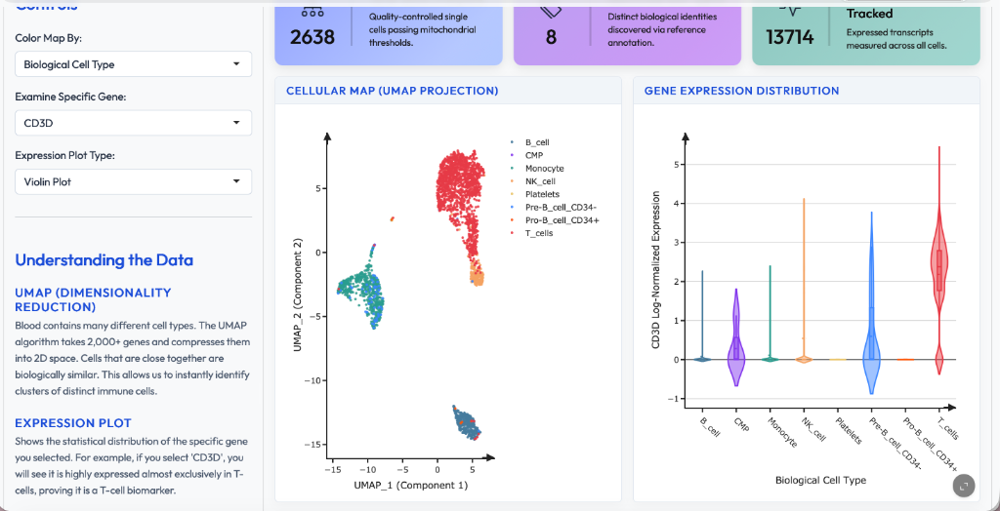

# Single-Cell RNA-Seq Transcriptomics Explorer (PBMC)



This repository contains an end-to-end Computational Biology pipeline and interactive visualization dashboard built in R. I processed raw Peripheral Blood Mononuclear Cell (PBMC) scRNA-seq data through quality control, normalization, dimensionality reduction, cell-type annotation, and deployed it as a responsive Shiny application.

**[Link to Live Dashboard](https://019f3fdd-671c-5499-a2ef-a297424cb872.share.connect.posit.cloud/)**

**Dataset Citation:** The data utilized in this project is the publicly available [10x Genomics PBMC 3k dataset](https://www.10xgenomics.com/resources/datasets/3-k-pbm-cs-from-a-healthy-donor-1-standard-1-1-0), sequenced on the Chromium system.

---

## 📊 Key Results & Findings

After fully processing the 10x Genomics dataset, the pipeline successfully retained **~2,638 highly viable cells** across 9 distinct transcriptomic clusters. 

Using the `SingleR` algorithmic database and manual marker validation, I successfully annotated these mathematical clusters into their true biological lineages:
* **T Cells (CD4+ and CD8+):** The most dominant population (~60% of the sample), driven by massive upregulation of *CD3D*, *IL7R*, and *CD2*.
* **Monocytes (CD14+ and FCGR3A+):** The second largest population (~20%), defined by textbook markers like *S100A8*, *S100A9*, and *LYZ*.
* **B Cells:** Accounting for ~10% of the sample, cleanly separated by *CD79A* and *MS4A1* (CD20) expression.
* **NK Cells & Platelets:** Smaller, distinct clusters representing the remainder of the captured sample.

---

## 🧬 Pipeline Methods

### 1. Quality Control (QC)
In single-cell RNA sequencing, it is vital to mathematically remove dead, dying, or ruptured cells before analysis. 
- **Mitochondrial Threshold (< 5%):** Apoptotic or lysed cells leak their cytoplasmic RNA, leaving behind a disproportionate ratio of mitochondrial RNA (which is protected inside the mitochondrial membrane). I strictly filtered out cells with `> 5%` mitochondrial RNA.
- **Gene Count Threshold (200 < nFeature_RNA < 2500):** I excluded empty droplets (cells expressing very few genes) and doublets (two cells captured in one droplet, resulting in abnormally high gene counts).
- *Of the ~20,000 protein-coding genes in the human genome, roughly 13,000+ were detected in this dataset after filtering.*

### 2. Normalization & Dimensionality Reduction
- **Highly Variable Genes (HVGs):** After log-normalizing the data, I did not run dimensionality reduction on the full 13,000+ gene matrix. Instead, I isolated the top 2,000 highly variable genes to focus the algorithm strictly on true biological variance.
- **PCA & UMAP:** I scaled those 2,000 genes and ran Principal Component Analysis (PCA), utilizing an elbow plot to select the top 10 principal components. I then compressed these 10 dimensions into 2D space via UMAP to visually cluster identical immune cells.

### 3. Differential Expression & Biomarker Annotation
I utilized the Wilcoxon Rank Sum test via Seurat's `FindAllMarkers` algorithm to identify statistically significant biomarker genes that define each cluster. 
- *Note on Housekeeping Genes:* Basic survival genes (e.g., *ACTB*, *GAPDH*) are expressed across all cells. They are excluded from my Biomarker tables because they do not uniquely separate distinct immune identities.

---

## 🔬 Limitations & Discussion

While the pipeline successfully resolved the major immune lineages, working with a small, single-condition public dataset presents known limitations:
* **Algorithmic vs. Manual Annotation:** `SingleR` correctly identified the broad lineages (T cells, B cells), but mathematical annotation often struggles with highly similar sub-states. For example, CD4+ and CD8+ T cells share massive amounts of transcriptomic machinery, requiring manual marker validation (e.g., *IL7R* vs *CD8A*) to confidently separate them.
* **Lack of Condition Comparison:** Because this dataset represents a single healthy donor, this pipeline cannot identify disease-specific markers. A future expansion of this project would require integrating a diseased dataset (e.g., Lupus or COVID-19 PBMCs) to perform true condition-based differential expression.

---

## 🚀 The Interactive Dashboard

The results are compiled into an R Shiny Dashboard built with `bslib` and `plotly`.

### Technical Features:
- **Responsive UI:** A clean, responsive dashboard architecture featuring an integrated light/dark mode.
- **Server-Side Selectize:** Employs `server = TRUE` for gene selection, avoiding the browser crash that occurs when loading 13,000+ HTML options into the client simultaneously.
- **Plotly WebGL Integration:** Renders thousands of individual data points effortlessly with custom tooltips and interactive hover states.

---

## 🛠️ Reproducible Environment (`renv`)

This project is fully production-ready and reproducible. All dependencies (Seurat, Shiny, Bslib, Plotly, DT) are tracked via `renv`.

### How to Run Locally

1. Clone this repository.
2. Open the project in RStudio.
3. Restore the exact package environment:
   ```R
   renv::restore()
   ```
4. Launch the dashboard:
   ```R
   shiny::runApp()
   ```

## 📂 Project Architecture

```
scRNA_atlas_project/
├── renv/                       # Isolated reproducible R environment
├── pipeline_env.lock                   # Package versions and hashes
├── data/                       # Raw cellranger output (matrix, features, barcodes)
├── computational_pipeline/     # Step-by-step pipeline tutorials (.md)
├── results/                    # Compiled .rds objects and CSV biomarker data
├── figures/                    # Custom generated ggplot2 visualizations
├── www/                        # Custom CSS (custom.css)
├── app.R                       # Full Dashboard architecture script
├── LICENSE                     # Open-source License
└── README.md                   # Documentation
```
