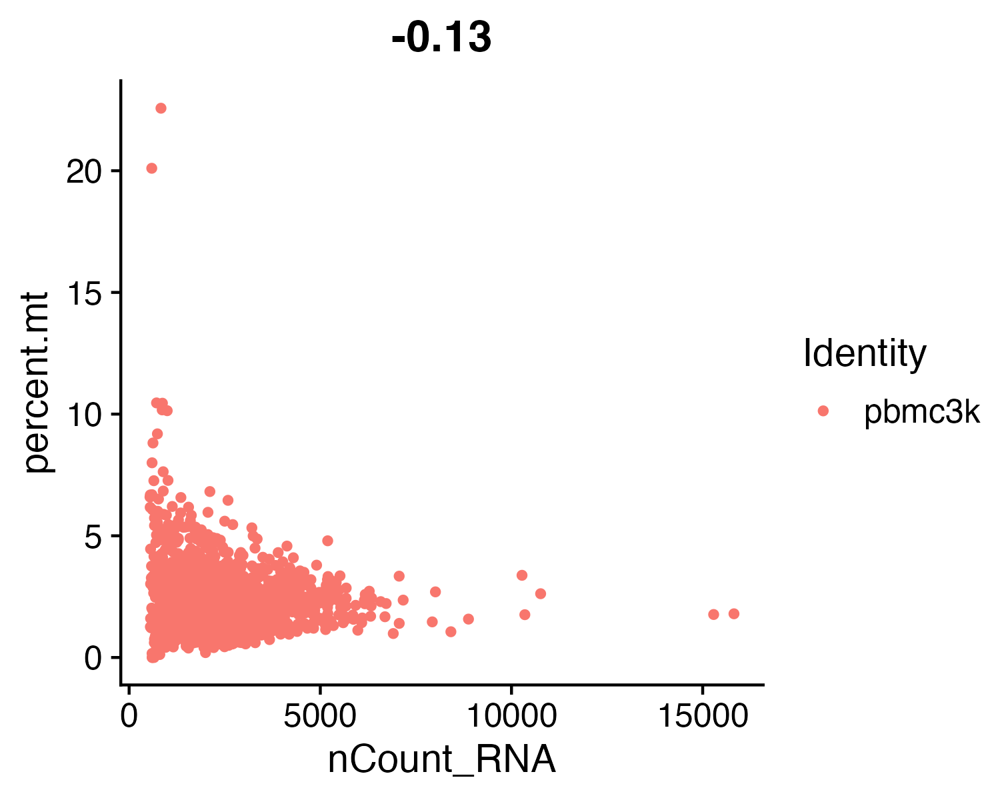

# Phase 1: Quality Control

**Overview**: In this file, I am taking the raw single-cell sequencing data straight from the 10x Genomics machine and cleaning it up. Raw data is incredibly noisy and full of dead cells, empty droplets, and technical errors. Before we can do any actual clustering or biological analysis, we *have* to filter all that junk out, otherwise it will completely ruin the rest of the project. This script walks through how I load the data, calculate the quality metrics, and subset the cells.

---

## 1. Environment Setup

Make sure you keep in mind that single-cell packages in R can be very finicky with versions. Here, I load `Seurat` (which is the main engine we use for everything) and `tidyverse` for data manipulation.

```r
# Load the Seurat package for single-cell analysis
library(Seurat)
# Load tidyverse for data wrangling and plotting
library(tidyverse)
# Load ggplot2 explicitly for plotting
library(ggplot2)
```

---

## 2. Loading the Raw Data

I got these files straight from the standard 10x Genomics PBMC dataset. They come as three specific files (matrix, barcodes, and features) inside a folder. 

When you use `Read10X`, it automatically grabs those files and turns them into a matrix. Then, I convert it into a `SeuratObject`. Notice that I set `min.cells = 3` and `min.features = 200` right at the start. You should do this like this because it immediately drops genes that are barely expressed and droplets that barely have any RNA, saving your computer a ton of memory from the get-go.

```r
# Point to the directory containing the raw matrix files
mat_path <- "../data/pbmc3k/filtered_gene_bc_matrices/hg19"

# Load the raw 10x data into a sparse matrix
counts   <- Read10X(data.dir = mat_path)

# Create the Seurat object and apply a very lenient initial filter
pbmc <- CreateSeuratObject(counts = counts, project = "pbmc3k", min.cells = 3, min.features = 200)
```

---

## 3. Checking for Dead Cells (Mitochondrial RNA)

This is a critical step. When a cell dies or is stressed, its membrane breaks and all its normal RNA leaks out. But the mitochondria are tough, so their RNA stays trapped inside. That means if a droplet has a very high percentage of mitochondrial RNA, you are almost certainly just looking at a dead cell. 

To find these, I tell Seurat to look for any gene name that starts with `MT-` and calculate what percentage of the total RNA that makes up.

```r
# Calculate the percentage of counts originating from mitochondrial genes
pbmc[["percent.mt"]] <- PercentageFeatureSet(pbmc, pattern = "^MT-")
```

---

## 4. Visualizing the Quality Metrics

Before you drop any data, you have to look at it to figure out where the cutoffs should be. I generated two plots to help with this.

```r
# Generate a Violin Plot for the three main quality metrics
VlnPlot(pbmc, features = c("nFeature_RNA", "nCount_RNA", "percent.mt"), ncol = 3, pt.size = 0.1, cols = "#3A86FF") +
  theme(axis.line = element_line(arrow = arrow(length = unit(0.3, "cm"), type = "closed")),
        plot.title = element_text(face = "bold", size = 14)) +
  labs(title = "Figure 1: Quality Control Metrics", subtitle = "Distribution of RNA counts and Mitochondrial percentage", y = "Count / Percentage")
```


```r
# Generate a Scatter Plot comparing total RNA to Mitochondrial percentage
FeatureScatter(pbmc, feature1 = "nCount_RNA", feature2 = "percent.mt", pt.size = 0.5, cols = "#FF006E") +
  theme_classic() +
  theme(axis.line = element_line(arrow = arrow(length = unit(0.3, "cm"), type = "closed")),
        legend.position = "none",
        plot.title = element_text(face = "bold", size = 14)) +
  labs(title = "Figure 2: Mitochondrial vs Total RNA", subtitle = "Scatter plot identifying stressed/dying cells (high MT%)", x = "Total RNA Molecules Detected", y = "Mitochondrial Percentage (%)")
```



---

## 5. Filtering Out the Bad Data

Based on those images, I saw that the vast majority of healthy cells had less than 5% mitochondrial RNA. I also saw that most cells had between 200 and 2,500 unique genes (`nFeature_RNA`). Anything over 2,500 is likely a "doublet" (two cells accidentally trapped in the same droplet), and anything under 200 is just empty fluid.

Make sure you do it like this: If you set your filters too strictly, you might throw away rare, biologically important cells. If you set them too loose, your final clustering will look like a mess. 

```r
# Filter the Seurat object to keep only the high-quality cells
pbmc <- subset(pbmc, subset = nFeature_RNA > 200 & nFeature_RNA < 2500 & percent.mt < 5)
```

---

## 6. Saving the Clean Data

Finally, since loading and filtering raw data takes time and memory, you should always save your processed objects. I saved this as an `.rds` file so I can just load it directly into Phase 2 without having to rerun the QC steps.

```r
# Save the filtered Seurat object as an R data file
saveRDS(pbmc, "../results/01_pbmc_filtered.rds")
```
