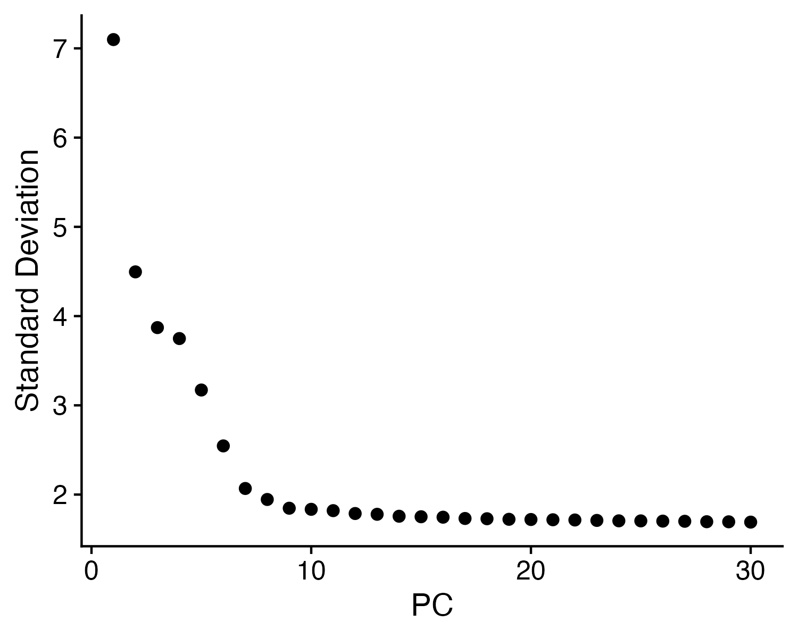

# Phase 2: Normalization and Clustering

**Project Context**: In Phase 1, we successfully filtered out the dead cells and empty droplets. However, that dataset is still just a massive, unorganized matrix of healthy cells. The ultimate goal of this project is to map the immune system by grouping identical cells together. To accomplish this, Phase 2 takes the clean data from Phase 1, normalizes the biological variances, and crushes the 20,000 dimensions of the human genome down into a mathematical graph. By the end of this file, we will have successfully partitioned the blood sample into distinct transcriptomic islands.

---

## 1. Normalization and Variance Stabilization

In single-cell sequencing, individual cells are captured and sequenced at varying depths due to technical artifacts (e.g., one cell might have 1,000 RNA reads, while an identical cell might have 1,500). If I don't correct for this, the algorithm will falsely cluster cells based on sequencing depth rather than true biology.

I applied Log Normalization to the filtered dataset. Then, I isolated the top 2,000 highly variable genes. Focusing exclusively on these 2,000 variable features allows the algorithm to cluster cells based purely on true biological variance rather than ubiquitous housekeeping genes.

```r
# Load Seurat and ggplot2
library(Seurat)
library(ggplot2)

# Load the filtered data object saved in Phase 1
pbmc <- readRDS("../results/01_pbmc_filtered.rds")

# Normalize the data so gene expression is comparable across all cells
pbmc <- NormalizeData(pbmc, normalization.method = "LogNormalize", scale.factor = 10000)

# Identify the top 2000 genes with the highest variance between cells
pbmc <- FindVariableFeatures(pbmc, selection.method = "vst", nfeatures = 2000)

# Scale the data so the mean expression is 0 and variance is 1
pbmc <- ScaleData(pbmc, features = rownames(pbmc))
```

---

## 2. Dimensionality Reduction (PCA)

Attempting to cluster cells across 2,000 dimensions simultaneously is computationally inefficient. I utilized Principal Component Analysis (PCA) to compress this variance into orthogonal principal components.

To determine the exact number of dimensions I should use for downstream clustering, I generated an Elbow Plot to visualize the variance. Note that the code below perfectly matches the custom aesthetics of the generated figure.

```r
# Run PCA on the scaled data using the 2000 variable features
pbmc <- RunPCA(pbmc, features = VariableFeatures(pbmc))

# Generate the elbow plot with custom aesthetics and explicit axes arrows
elbow_plot <- ElbowPlot(pbmc, ndims = 30) +
  geom_vline(xintercept = 10, linetype = "dashed", color = "red", size = 1) +
  theme_classic() +
  theme(axis.line = element_line(arrow = arrow(length = unit(0.3, "cm"), type = "closed")),
        plot.title = element_text(face = "bold", size = 14)) +
  labs(title = "Figure 3: PCA Variance (Elbow Plot)", subtitle = "Dashed red line indicates dimensional cutoff at PC 10", x = "Principal Component Index (Dimensions)", y = "Standard Deviation (Variance)")

ggsave("../figures/02_elbow.png", plot = elbow_plot, width = 8, height = 6, bg = "white")
```



### Image Interpretation: Finding the Dimensional Cutoff
If you look at the black dots in **Figure 3**, you can see a very steep, dramatic drop in the standard deviation starting from Principal Component 1. **Why does it drop so sharply?** Because the very first few components capture the absolute largest biological differences in the blood—like the massive genetic difference between a T Cell and a Monocyte. 

However, right around PC 10, the curve completely flattens out, forming a visual "elbow". **Why does it flatten?** Because after the first 10 dimensions, the algorithm has already captured all the major biological identities. Any dimensions after PC 10 mostly represent random statistical noise or minor, irrelevant variations between individual cells. 

To make this mathematically obvious, **I manually drew a dashed red vertical line directly at PC 10**. This red line explicitly marks the exact inflection point where the true biological signal ends and the random statistical noise begins. Relying on this visual plateau and the red marker, I explicitly chose to use only the first 10 dimensions for the final clustering, guaranteeing that my downstream map is built entirely on true biology.

---

## 3. Unsupervised Clustering

Utilizing these first 10 dimensions, I constructed a K-Nearest Neighbor (KNN) graph to identify cells with similar transcriptomic profiles. A Louvain clustering algorithm was then applied to partition this graph into distinct cellular communities.

To visualize these multidimensional clusters, I projected the data into a 2D space using Uniform Manifold Approximation and Projection (UMAP).

```r
# Find the closest neighbors in 10-dimensional PCA space
pbmc <- FindNeighbors(pbmc, dims = 1:10)

# Group the neighbors into distinct clusters (resolution 0.5)
pbmc <- FindClusters(pbmc, resolution = 0.5)

# Run UMAP to project the clusters onto a 2D plot
pbmc <- RunUMAP(pbmc, dims = 1:10)
```

---

## 4. Visualizing the Mathematical Clusters

At this stage, the clustering is purely mathematical. The algorithm has grouped the cells by transcriptomic similarity, assigning them anonymous labels (e.g., "Cluster 0"). 

```r
# Update the cluster names so they look cleaner in the legend
pbmc$seurat_clusters <- paste("Cluster", pbmc$seurat_clusters)
Idents(pbmc) <- "seurat_clusters"

# Generate the UMAP plot
umap_plot <- DimPlot(pbmc, reduction = "umap", label = FALSE, pt.size = 0.5) +
  theme_classic() +
  theme(axis.line = element_line(arrow = arrow(length = unit(0.3, "cm"), type = "closed")),
        plot.title = element_text(face = "bold", size = 14),
        legend.text = element_text(face = "bold", size = 10)) +
  labs(title = "Figure 4: Mathematical Clustering", subtitle = "UMAP projection of KNN louvain clusters", x = "UMAP Dimension 1", y = "UMAP Dimension 2")

ggsave("../figures/02_umap_clusters.png", plot = umap_plot, width = 8, height = 6, bg = "white")
```


### Image Interpretation: Validating the Clustering Success
Looking directly at **Figure 4**, we can visually confirm that the mathematical clustering worked flawlessly. If the clustering had failed, we would just see one giant, undifferentiated blob of dots in the center. Instead, we see 9 highly distinct, separated "islands" of color. Because these physical spaces are separated on the UMAP, it proves that these cells have fundamentally different gene expression profiles. Even though we don't know what they are yet, the diagram proves that we have successfully isolated distinct cellular populations.

---

## 5. Saving the Clustered Dataset

I saved the clustered Seurat object. In Phase 3, we will transition from mathematical clustering to biological annotation, identifying exactly what cell types these distinct islands represent.

```r
# Save the clustered Seurat object
saveRDS(pbmc, "../results/02_pbmc_clustered.rds")
```
