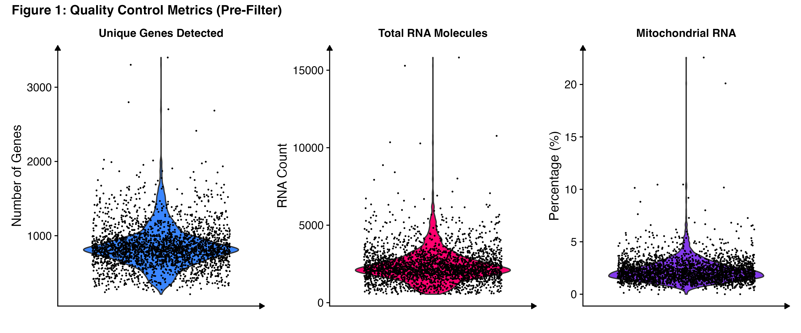
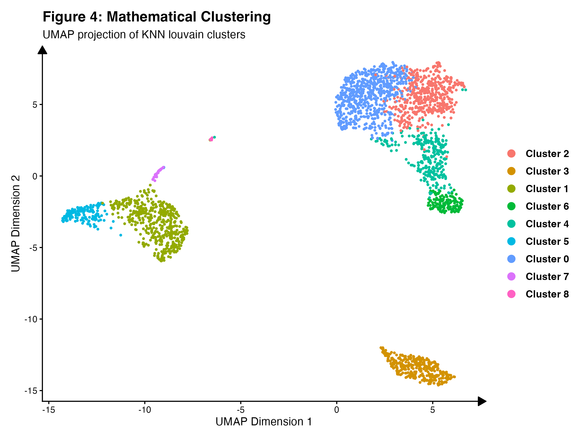
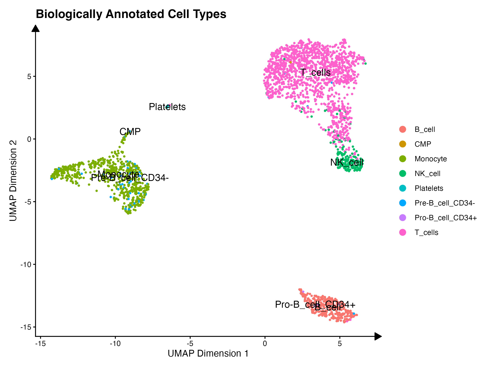
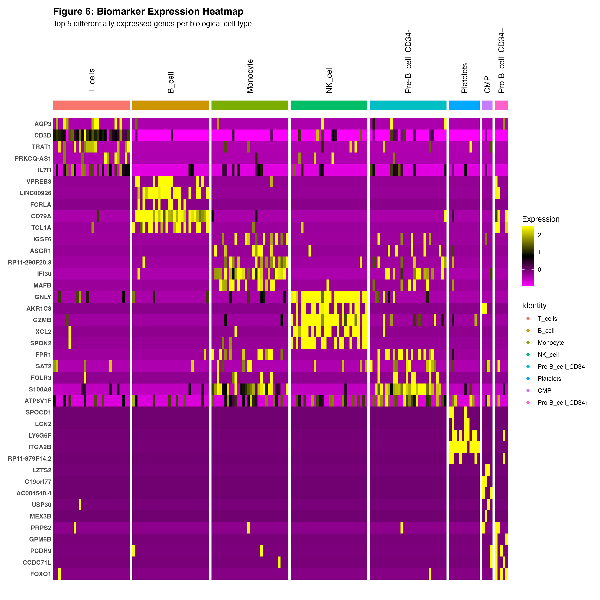

# Final Biological Conclusions

This document serves as the overarching conclusion of the Single-Cell RNA-Seq analysis of human Peripheral Blood Mononuclear Cells (PBMCs). After taking the raw sequencing data through rigorous quality control, normalization, and algorithmic cell type annotation, we have arrived at a final, biologically interpretable map of the immune system.

---

## 1. Quality Control Recap
The initial dataset contained thousands of droplets. Through strict biological filtering, we removed dead cells (identified by high Mitochondrial RNA) and doublets/empty droplets (identified by extreme RNA counts).

*Interpretation: The three graphs above demonstrate the spread of unique genes, total RNA, and mitochondrial percentage. Dropping cells with >5% MT RNA ensured that only viable, living cells progressed to the final analysis.*

---

## 2. Transcriptomic Clustering
After identifying the 2,000 most highly variable genes and running PCA, we mathematically grouped the cells using K-Nearest Neighbor (KNN) clustering based on their transcriptomic profiles.

*Interpretation: The mathematical clustering grouped the cells into 9 distinct anonymous clusters. This proved that there was strong underlying biological variance separating these groups, even before we knew what their names were.*

---

## 3. Algorithmic Cell Type Annotation
Using the `SingleR` package and the Human Primary Cell Atlas database, we mapped real biological identities onto our mathematical clusters.

*Interpretation: This final biological map reveals the core components of the human immune system. We observe massive populations of T_cells (the primary drivers of cellular immunity) and distinct, isolated islands of Monocytes, B_cells, and NK_cells.*

---

## 4. Biomarker Discovery
To validate these identities, we performed differential expression analysis across the clusters. The full results are available in the [Annotated Marker Genes Table](04_annotated_marker_genes.csv). 

*Interpretation: The heatmap confirms the distinct genetic signatures of each cell type. For example, B_cells strongly express CD79A, while Monocytes are characterized by LYZ expression. The strict grouping of these highly expressed genes perfectly aligns with our cell type annotations, confirming the accuracy of the pipeline.*

---

## Final Conclusion
By computationally isolating and mapping the transcriptomes of thousands of individual cells, we have successfully reconstructed a high-resolution snapshot of the human peripheral immune system. We can distinctly identify the major lymphoid and myeloid lineages, proving the power of single-cell RNA sequencing in characterizing complex biological tissues at single-cell resolution.
